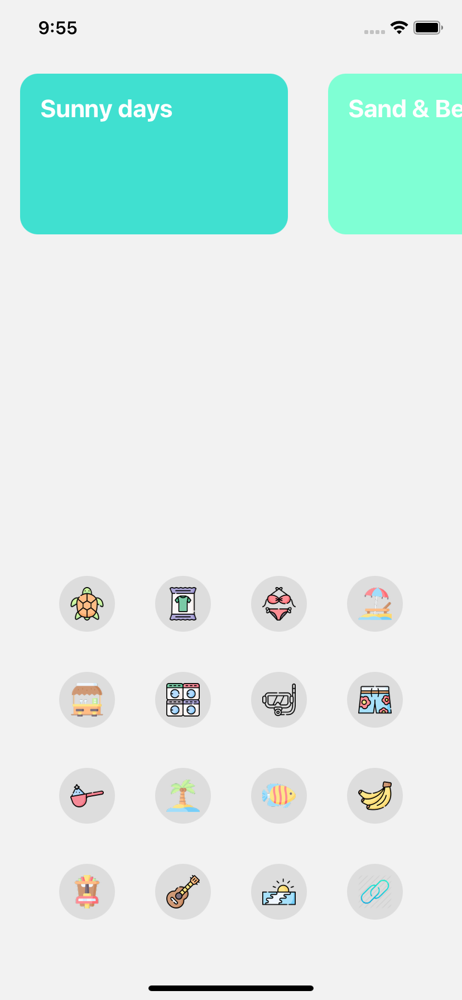

# React Native Shared Element Transition using React Navigation

## Setup New Expo project

### Dependency:

[https://github.com/IjzerenHein/react-navigation-shared-element/tree/navigation-v5](https://github.com/IjzerenHein/react-navigation-shared-element/tree/navigation-v5)

[https://reactnavigation.org/docs/getting-started](https://reactnavigation.org/docs/getting-started)

### Screenshot

1. 
2. 

### GIF

